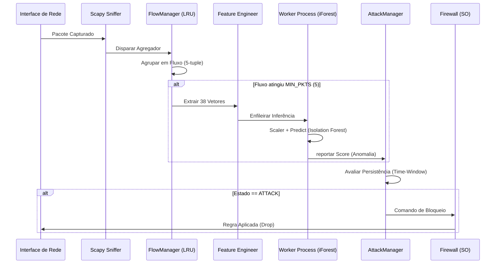

# 🌲 Forest Sentinel (Sentinela da Floresta)

> **Manual Técnico Completo e Documentação de Arquitetura**
> **Sistema de Detecção e Mitigação de DDoS em Tempo Real Baseado em IA**

O **Forest Sentinel** é uma solução de vanguarda projetada para monitorar, detectar e mitigar ataques de Negação de Serviço Distribuída (DDoS) utilizando técnicas avançadas de **Aprendizado de Máquina Não Supervisionado**. 

---

## 1. Arquitetura de Defesa em Camadas

O sistema opera em cinco camadas distintas para garantir eficiência máxima e latência mínima:

### Fluxo de Processamento (Diagrama de Sequência)



---

## 2. O Motor de IA: Isolation Forest (iForest)

O Forest Sentinel opta pelo algoritmo **Isolation Forest** por sua capacidade intrínseca de detectar anomalias sem necessidade de treinamento prévio com cada variação de ataque.

- **Filosofia**: Em vez de perfilar o tráfego normal, o iForest isola pontos que "parecem diferentes". Ataques DDoS são, por definição, anomalias estatísticas massivas.
- **Thresholds por Perfil**:
  - **Home** (`-0.30`): Menos sensível, ideal para redes com tráfego doméstico variado.
  - **PME** (`-0.15`): Equilibrado para ambientes corporativos.
  - **Datacenter** (`0.00`): Altamente sensível, detecta variações mínimas em tráfego de servidores.

---

## 3. Glossário Técnico das 38 Features

Cada fluxo de rede é convertido em um vetor numérico de 38 dimensões baseado no padrão **CICFlowMeter**.

| # | Feature | Descrição Técnica |
|---|---|---|
| 1 | `flow_duration` | Duração total do fluxo em microssegundos. |
| 2 | `fwd_pkt_max` | Tamanho máximo do pacote na direção de ida (forward). |
| 3 | `fwd_pkt_min` | Tamanho mínimo do pacote na direção de ida. |
| 4 | `bwd_pkt_min` | Tamanho mínimo do pacote na direção de volta (backward). |
| 5 | `flow_bytes_s` | Taxa de transferência total (Bytes por segundo). |
| 6 | `flow_pkts_s` | Taxa de pacotes total (Pacotes por segundo). |
| 7 | `fwd_iat_min` | Tempo mínimo entre chegadas de pacotes (Ida). |
| 8 | `bwd_iat_min` | Tempo mínimo entre chegadas de pacotes (Volta). |
| 9 | `bwd_psh` | Contagem de flags PSH na direção de volta. |
| 10 | `fwd_urg` | Contagem de flags URG na direção de ida. |
| 11 | `bwd_urg` | Contagem de flags URG na direção de volta. |
| 12 | `bwd_header_len` | Somatório dos tamanhos de cabeçalho IP/TCP (Volta). |
| 13 | `bwd_pkts_s` | Taxa de pacotes na direção de volta. |
| 14 | `min_pkt_length` | Menor pacote detectado em todo o fluxo. |
| 15 | `pkt_len_var` | Variância estatística do tamanho dos pacotes. |
| 16 | `fin_count` | Total de flags FIN (Finalização de conexão). |
| 17 | `syn_count` | Total de flags SYN (Início de conexão/Handshake). |
| 18 | `rst_count` | Total de flags RST (Reset de conexão). |
| 19 | `psh_count` | Total de flags PSH (Push de dados). |
| 20 | `ack_count` | Total de flags ACK (Acknowledge). |
| 21 | `urg_count` | Total de flags URG (Urgência). |
| 22 | `cwr_count` | Flags de Congestion Window Reduced (CWR). |
| 23 | `ece_count` | Flags ECN Echo. |
| 24 | `down_up_ratio` | Razão entre tráfego de download e upload. |
| 25 | `fwd_header_len` | Somatório dos cabeçalhos na direção de ida. |
| 26-28| `fwd_bulk_*` | Métricas de rajadas (Bulk) na direção de ida (Bytes, Pkts, Rate). |
| 29-31| `bwd_bulk_*` | Métricas de rajadas (Bulk) na direção de volta. |
| 32 | `subflow_fwd` | Bytes totais em subfluxos de ida. |
| 33 | `init_win_fwd` | Tamanho inicial da janela TCP (Ida). |
| 34 | `init_win_bwd` | Tamanho inicial da janela TCP (Volta). |
| 35-36| `active_*` | Estreitamento de janelas ativas (Std, Max). |
| 37 | `idle_std` | Desvio padrão do tempo de inatividade do fluxo. |
| 38 | `inbound` | Flag binária (1.0 se Destino é Local e Origem é Externa). |

---

## 4. Limites e Constantes Sistêmicas

Estes valores estão definidos em `constants.py` e garantem a estabilidade do sistema:

- `FLOW_TIMEOUT = 10s`: Fluxos sem pacotes por 10s são considerados encerrados.
- `MIN_PKTS = 5`: O sistema aguarda 5 pacotes para ter uma amostra estatística confiável antes da IA agir.
- `MAX_FLOWS = 5000`: Limite de fluxos simultâneos em memória para evitar consumo excessivo de RAM.
- `LEVEL2_SECS = 60s`: Tempo que um IP precisa ser detectado como "Ataque" continuamente para sofrer bloqueio automático.

---

## 5. Guia de Solução de Problemas (Troubleshooting)

### O aplicativo não inicia ou "trava" no splash
- **Causa**: Falta de privilégios de Administrador.
- **Solução**: Clique com o botão direito no executável e selecione "Executar como Administrador". O sistema precisa de acesso direto aos drivers de rede.

### Nenhum tráfego é detectado (0 PPS)
- **Causa**: Driver **Npcap** não instalado ou interface errada selecionada.
- **Solução**: Instale o Npcap (em modo `WinPcap compatibility`). Vá nas configurações da UI e verifique se a interface selecionada é a correta (ex: Ethernet, WiFi).

### Bloqueios Falsos Positivos
- **Causa**: Threshold de IA muito baixo para a sua rede.
- **Solução**: Altere o perfil de "Datacenter" ou "PME" para **"Home"** nas configurações. Adicione o IP afetado à `Whitelist` na aba "Segurança".

---

## 6. Estrutura do Projeto para Desenvolvedores

```text
/ddos_monitor
├── bin/          # Executáveis compilados
├── config/       # Arquivos de whitelist e config.json
├── logs/         # Auditoria granular do sistema
├── models/       # Modelos Scikit-Learn (Joblib) e Scalers
├── src/          # Código Fonte (Core)
│   ├── main.py             # Bootstrapper e UI Thread
│   ├── monitor_engine.py   # Orquestrador e Multiprocessing
│   ├── flow_manager.py     # Gerência de Estado de Fluxo
│   ├── attack_manager.py   # State Machine de Ameaças
│   ├── features.py         # Vetorização Matemática
│   ├── firewall.py         # Abstração de Regras de SO
│   └── dashboard.py        # Framework PyQt6 (Modern Dark UI)
└── tests/        # Suíte de Testes Unitários
```

---

> **Forest Sentinel** - Sua primeira linha de defesa em um mundo automatizado. Desenvolvido com foco em resiliência e precisão.
