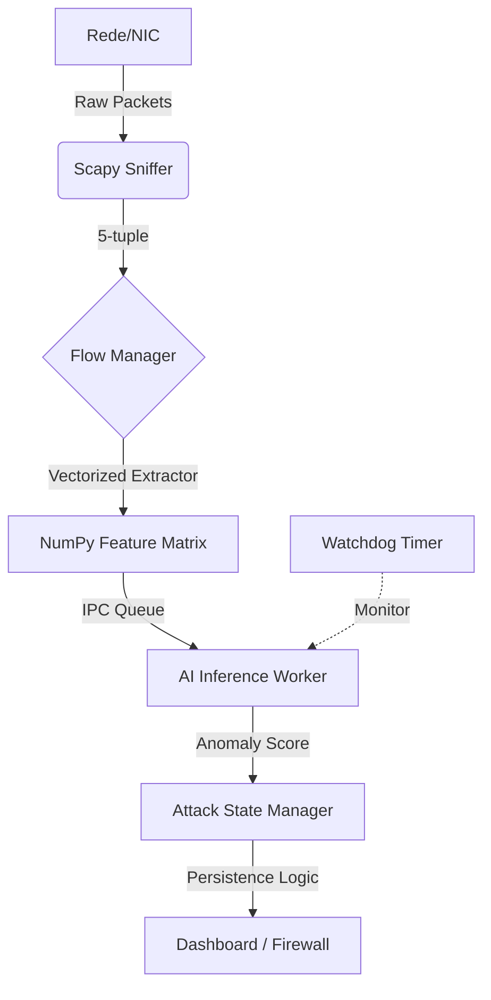

# 🌲 Forest Sentinel (Sentinela da Floresta) — Documentação Técnica v2.0

> **Manual Master de Engenharia e Arquitetura**
> **Sistema de Monitoramento DDoS de Alto Desempenho com IA e Vetorização NumPy**

---

## 🏗️ 1. Arquitetura de Sistema (High-Level)

O **Forest Sentinel** é construído sobre uma arquitetura de múltiplos processos (Multiprocessing) para garantir que a análise de IA pesada não interfira na captura de pacotes em tempo real.



### Componentes Core:
*   **Orquestrador (`MonitorEngine`)**: Coordena o ciclo de vida dos processos e a comunicação via IPC.
*   **Motor IA de Alta Precisão**: Integração com Scikit-Learn e Joblib para inferência em tempo real.
*   **Sincronização por Eventos**: Comunicação IPC otimizada entre o motor e o worker IA, eliminando polling e latência.
*   **Padronização Determinística**: Garantia de integridade de dados através de Enums (DetectionStatus) em todo o fluxo, da detecção à UI.
*   **Monitoramento Multi-Interface**: Detecção automática de adaptadores de rede e suporte a monitoramento simultâneo.
*   **Gestão Inteligente de Firewall**: Bloqueio automático e whitelist persistente via `nftables` (Linux) ou logs de auditoria (Windows).

---

## ⚡ 2. Motor de Extração Vetorizada (NumPy)

Para suportar redes de **1Gbps+**, o extrator de características foi totalmente reescrito usando operações vetorizadas em C via NumPy, substituindo loops Python lentos.

### Inovações Técnicas:
*   **Path de Alta Performance (Fast Path)**: Otimizações críticas no `flow_manager.py` reduzem o overhead do Scapy em até 50%, utilizando detecção de camada em passo único e caches de protocolo.
*   **Otimização `is_dirty`**: O pipeline de avaliação ignora fluxos sem atividade nova, economizando até 70% de processamento em tráfego de repouso.
*   **Arquitetura de Ciclo Único**: Avaliação de ameaças e geração de dados para UI ocorrem em um único ciclo O(N), minimizando iterações.
*   **Predição em Batch Otimizada**: Utiliza `np.vstack` para montagem de matrizes de alta performance no worker de IA, garantindo consistência entre fluxos síncronos e assíncronos.

---

## 🤖 3. Inteligência Artificial e Resiliência

O sistema utiliza **Isolation Forest** para detecção de anomalias estatísticas, com camadas extras de proteção para produção.

> **Watchdog & Resiliência**
> - **Auto-Recovery**: O sistema detecta a morte do processo de IA e o reinicia em menos de 1 segundo.
> - **Sincronização por Eventos**: Substituição do polling de 100ms por `threading.Event`, reduzindo drasticamente o uso de CPU e latência em predições síncronas.
> - **Gerenciamento de Memória**: Mecanismo de expurgo automático para resultados de IA órfãos, prevenindo memory leaks em execuções de longa duração.
> - **Crash-Loop Protection**: Se o processo falhar 5 vezes em menos de 60 segundos, o watchdog suspende o reinício automático.

### Perfis de Detecção (Thresholds):
| Perfil | Sensibilidade | Threshold (Anomaly Score) | Caso de Uso |
| :--- | :--- | :--- | :--- |
| **Home** | Baixa | `-0.30` | Redes domésticas com tráfego irregular. |
| **PME** | Média | `-0.15` | Escritórios e pequenas infraestruturas. |
| **Datacenter** | Máxima | `0.00` | Servidores expostos com tráfego previsível. |

---

## 📊 4. Especificações das 38 Features (Conformidade CIC)

| # | Métrica | Lógica de Cálculo |
| :--- | :--- | :--- |
| **1** | `flow_duration` | `diff(timestamps)`. 0.0 se apenas 1 pacote. |
| **2-4** | `pkt_size_min/max` | Estatísticas de tamanho por direção (Fwd/Bwd). |
| **5-6** | `flow_bytes/pkts_s` | Taxas globais baseadas na duração real. |
| **7-8** | `iat_min` | Intervalo mínimo entre pacotes (Forward e Backward). |
| **9-11** | `direction_flags` | Flags PSH/URG específicas por direção. |
| **12-13** | `bwd_stats` | Métricas exclusivas do tráfego de resposta. |
| **14-15** | `pkt_len_var` | Variância dos tamanhos para detectar inundação estática. |
| **16-23** | `tcp_flags` | Contagem total de FIN, SYN, RST, PSH, ACK, URG, CWR, ECE. |
| **24** | `down_up_ratio` | Razão de assimetria de tráfego. |
| **25-31** | `bulk_metrics` | Média de Bytes/Pkts/Rate em rajadas (IAT < 0.1s). |
| **32-34** | `init_windows` | Janela TCP do **primeiro pacote** de cada direção. |
| **35-37** | `active/idle` | Tempos de atividade x inatividade (Threshold 1.0s). |
| **38** | `inbound` | Boolean `1.0` se Origem é Externa e Destino é Privado/Local. |

---

## 🛡️ 5. Refinamentos de Segurança e Firewall

### Lógica de Graduação de Ameaça:
1.  **Suspeito (Amarelo)**: Anomalia detectada por < 30s.
2.  **Ataque (Vermelho)**: Anomalia persistente por > 60s.
3.  **Bloqueio (Firewall)**: IP de origem adicionado ao firewall do SO se a persistência exceder o limite de segurança.

- **Normalização Determinística de IPs**: Whitelist gerenciada via `ipaddress.ip_network`, garantindo que remoções e inclusões sejam consistentes e seguras contra variações de string.
- **Resiliência de Firewall**: Validação explícita de cada comando `nftables` (Linux) com reporte de status em tempo real, evitando falhas silenciosas na proteção.
- **IPv6 Local**: Proteção nativa para faixas ULA (`fc00::`) e Link-local (`fe80::`).
- **Check Defensivo de Features**: Fallback para vetor zerado em fluxos vazios, prevenindo erros de cálculo.

---

## 🚀 6. Futuro: Roadmap para Motor Nativo (Rust)

Para suportar ambientes de Datacenter (10Gbps+), está planejada a migração para um motor nativo:
- **Data Plane Híbrido**: Troca dinâmica entre motor Python (Home/PME) e Rust (Datacenter).
- **Kernel Bypass**: Suporte futuro para XDP (eBPF) no Linux e Npcap Direct no Windows.
- **Arquitetura Zero-Copy**: Eliminação do overhead do Python GIL no processamento core de pacotes.

---

## 🛠️ 6. Instalação e Manutenção

### Requisitos:
*   **Python 3.10+** (Recomendado 3.12 ou 3.13).
*   **Npcap**: Instalado com a opção `WinPcap Compatibility`.
*   **Dependências**: `pip install numpy scapy pyqt6 joblib scikit-learn`.

### Suíte de Testes:
O projeto inclui 16 testes unitários e de integração:
- `pytest tests/test_features.py`: Valida a integridade matemática dos 38 vetores.
- `pytest tests/test_async_ai.py`: Valida o Watchdog e o IPC.
- `pytest tests/test_flow.py`: Valida o gerenciador de memória LRU.

---

## 📁 7. Estrutura de Arquivos

```text
/ddos_monitor
├── bin/          # Compilados finalizados
├── config/       # White/Blacklists e configurações JSON
├── models/       # [SENSÍVEL] ddos_detection.pkl e scaler.pkl
├── src/
│   ├── main.py             # Entrada e Gestão de Threads UI
│   ├── monitor_engine.py   # Orquestrador de Processos e Watchdog
│   ├── flow_manager.py     # Gestão LRU e Snapshot de Fluxos
│   ├── features.py         # Motor Matemático NumPy
│   ├── attack_manager.py   # State Machine de Ameaças
│   ├── constants.py        # Configurações globais e limiares
│   ├── utils.py            # Utilitários de IP e Assets
│   └── dashboard.py        # Interface Gráfica Premium
└── tests/        # Cobertura de Testes Automatizada
```

---

> **Forest Sentinel** — Desenvolvido para resiliência máxima e análise silenciosa. Uma sentinela invisível na sua infraestrutura de rede.
