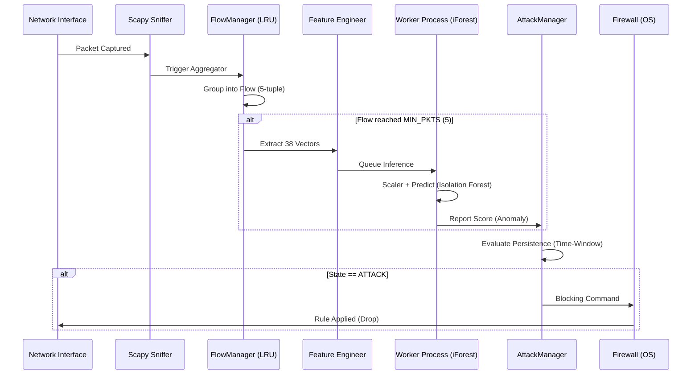

# 🌲 Forest Sentinel

> **Complete Technical Manual & Architecture Documentation**
> **AI-Powered Real-Time DDoS Detection & Mitigation System**

**Forest Sentinel** is a cutting-edge solution designed to monitor, detect, and mitigate Distributed Denial of Service (DDoS) attacks using advanced **Unsupervised Machine Learning** techniques.

---

## 1. Layered Defense Architecture

The system operates across five distinct layers to ensure maximum efficiency and minimum latency:

### Processing Flow (Sequence Diagram)



---

## 2. The AI Engine: Isolation Forest (iForest)

Forest Sentinel utilizes the **Isolation Forest** algorithm for its intrinsic ability to detect anomalies without requiring prior training on every attack variation.

- **Philosophy**: Instead of profiling normal traffic, iForest isolates points that "look different." DDoS attacks are, by definition, massive statistical anomalies.
- **Inference Strategy**: Runs in a separate process to bypass Python's GIL, ensuring the packet sniffer never drops data.
- **Thresholds by Profile**:
  - **Home** (`-0.30`): Less sensitive, ideal for varied home network traffic.
  - **SMB/PME** (`-0.15`): Balanced for corporate environments.
  - **Datacenter** (`0.00`): Highly sensitive, detects minute variations in server traffic.

---

## 3. Technical Glossary of the 38 Features

Each network flow is converted into a 38-dimensional numerical vector based on the **CICFlowMeter** standard.

| # | Feature | Technical Description |
|---|---|---|
| 1 | `flow_duration` | Total duration of the flow in microseconds. |
| 2 | `fwd_pkt_max` | Maximum packet size in the forward direction. |
| 3 | `fwd_pkt_min` | Minimum packet size in the forward direction. |
| 4 | `bwd_pkt_min` | Minimum packet size in the backward direction. |
| 5 | `flow_bytes_s` | Total throughput rate (Bytes per second). |
| 6 | `flow_pkts_s` | Total packet rate (Packets per second). |
| 7 | `fwd_iat_min` | Minimum Inter-Arrival Time between packets (Forward). |
| 8 | `bwd_iat_min` | Minimum Inter-Arrival Time between packets (Backward). |
| 9 | `bwd_psh` | Count of PSH flags in the backward direction. |
| 10 | `fwd_urg` | Count of URG flags in the forward direction. |
| 11 | `bwd_urg` | Count of URG flags in the backward direction. |
| 12 | `bwd_header_len` | Sum of IP/TCP header sizes (Backward). |
| 13 | `bwd_pkts_s` | Packet rate in the backward direction. |
| 14 | `min_pkt_length` | Smallest packet detected in the entire flow. |
| 15 | `pkt_len_var` | Statistical variance of packet sizes. |
| 16 | `fin_count` | Total FIN flags (Connection termination). |
| 17 | `syn_count` | Total SYN flags (Connection handshake). |
| 18 | `rst_count` | Total RST flags (Connection reset). |
| 19 | `psh_count` | Total PSH flags (Data push). |
| 20 | `ack_count` | Total ACK flags (Acknowledgment). |
| 21 | `urg_count` | Total URG flags (Urgent). |
| 22 | `cwr_count` | Congestion Window Reduced (CWR) flags. |
| 23 | `ece_count` | ECN Echo flags. |
| 24 | `down_up_ratio` | Ratio of download to upload traffic. |
| 25 | `fwd_header_len` | Sum of headers in the forward direction. |
| 26-28| `fwd_bulk_*` | Bulk burst metrics in the forward direction (Bytes, Pkts, Rate). |
| 29-31| `bwd_bulk_*` | Bulk burst metrics in the backward direction. |
| 32 | `subflow_fwd` | Total bytes in forward subflows. |
| 33 | `init_win_fwd` | Initial TCP window size (Forward). |
| 34 | `init_win_bwd` | Initial TCP window size (Backward). |
| 35-36| `active_*` | Active window timing metrics (Std, Max). |
| 37 | `idle_std` | Standard deviation of flow idle time. |
| 38 | `inbound` | Binary flag (1.0 if Destination is Local and Source is External). |

---

## 4. System Limits & Constants

These values are defined in `constants.py` and ensure system stability:

- `FLOW_TIMEOUT = 10s`: Flows without packets for 10s are considered ended.
- `MIN_PKTS = 5`: The system waits for 5 packets for a reliable statistical sample before AI action.
- `MAX_FLOWS = 5000`: Limit of concurrent flows in memory to prevent memory exhaustion.
- `LEVEL2_SECS = 60s`: Time an IP must be continuously detected as "Attack" to trigger an auto-block.

---

## 5. Troubleshooting Guide

### Application doesn't start or "hangs" at splash
- **Cause**: Lack of Administrator privileges.
- **Solution**: Right-click the executable and select "Run as Administrator." The system requires direct access to network drivers.

### No traffic detected (0 PPS)
- **Cause**: **Npcap** driver not installed or wrong interface selected.
- **Solution**: Install Npcap (in `WinPcap compatibility mode`). Go to UI settings and verify the selected interface (e.g., Ethernet, WiFi).

### False Positive Blocks
- **Cause**: AI threshold too low for your network.
- **Solution**: Change the profile from "Datacenter" or "SMB" to **"Home"** in settings. Add the affected IP to the `Whitelist` in the "Security" tab.

---

## 6. Project Structure for Developers

```text
/ddos_monitor
├── bin/          # Compiled executables
├── config/       # Whitelist files and config.json
├── logs/         # Granular system auditing
├── models/       # Scikit-Learn models (Joblib) and Scalers
├── src/          # Source Code (Core)
│   ├── main.py             # Bootstrapper and UI Thread
│   ├── monitor_engine.py   # Orchestrator and Multiprocessing
│   ├── flow_manager.py     # Flow State Management
│   ├── attack_manager.py   # Threat State Machine
│   ├── features.py         # Mathematical Vectorization
│   ├── firewall.py         # OS Rule Abstraction
│   └── dashboard.py        # PyQt6 Framework (Modern Dark UI)
└── tests/        # Unit Testing Suite
```

---

> **Forest Sentinel** - Your first line of defense in an automated world. Built with a focus on resilience and precision.
