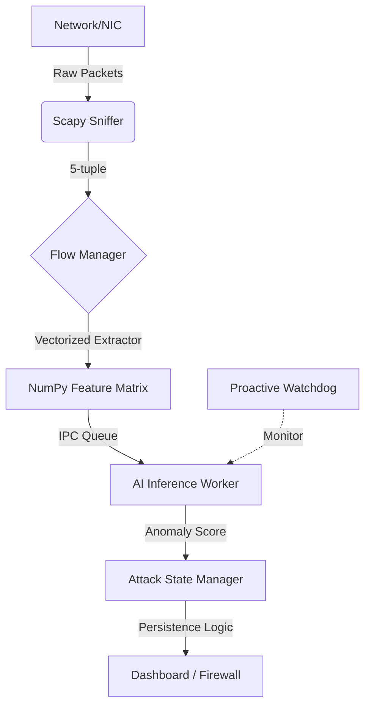

# 🌲 Forest Sentinel (Sentinela da Floresta)

> **High-Performance AI-Powered DDoS Detection & Mitigation System**
> **Real-time network monitoring with NumPy vectorization and proactive health monitoring.**

---

## 🏗️ 1. System Architecture

**Forest Sentinel** employs a sophisticated multi-processing architecture to ensure that heavy AI inference tasks never interfere with real-time packet capture performance.

### Core Components:
*   **Orchestrator (`MonitorEngine`)**: Manages process lifecycles and Inter-Process Communication (IPC).
*   **AI Inference Worker**: An isolated process running the Isolation Forest model for non-blocking analysis.
*   **Proactive Watchdog**: A dedicated monitor that tracks the AI worker's health. If the process crashes (e.g., OOM), it restarts within seconds to maintain defense continuity.

---

## ⚡ 2. Vectorized Feature Extraction (NumPy)

To handle high-throughput environments (**1Gbps+**), the feature extraction engine has been fully optimized using NumPy vectorized operations.

### Technical Performance Highlights:
*   **High-Throughput Fast Path**: Critical optimizations in `flow_manager.py` reduce Scapy overhead by up to 50% using single-pass layer detection and protocol caching.
*   **`is_dirty` Flow Filtering**: Evaluation pipeline skips stable flows (no new activity), reducing CPU overhead by up to 70% in typical network conditions.
*   **Single-Pass Loop Architecture**: Threat evaluation and UI data generation now occur in a unified O(N) cycle, minimizing list iterations.
*   **Optimized Batch Inference**: Uses `np.vstack` for high-performance memory allocation when sending features to the AI Worker, ensuring consistency between sync and async flows.

---

## 🤖 3. AI Resilience & Monitoring

The system uses **Isolation Forest** to detect statistical anomalies without needing prior knowledge of specific attack signatures.

> **Watchdog & Resilience**
> - **Self-Healing**: The watchdog detects AI process failure and triggers an automatic restart.
> - **Event-Driven Synchronization**: Replaced 100ms polling with `threading.Event`, drastically reducing CPU usage and latency for synchronous predictions.
> - **Memory Robustness**: Automatic cleanup mechanism for orphaned AI results, preventing memory leaks during long-running sessions.
> - **Crash-Loop Protection**: If the AI process fails 5 times within 60 seconds, the system pauses auto-restarts to prevent CPU exhaustion.

### Detection Profiles (Thresholds):
| Profile | Sensitivity | Anomaly Threshold | Ideal Use-Case |
| :--- | :--- | :--- | :--- |
| **Home** | Low | `-0.30` | Home networks with irregular traffic patterns. |
| **SMB/SME** | Medium | `-0.15` | Corporate offices and managed infrastructures. |
| **Datacenter** | High | `0.00` | Exposed servers with predictable traffic. |

---

## 📊 4. The 38-Feature Vector (CICFlowMeter Standard)

| # | Feature | Calculation Logic |
| :--- | :--- | :--- |
| **1** | `flow_duration` | Aggregated packet timestamps. 0.0 for single packets. |
| **2-4** | `pkt_size_stats` | Min/Max/Mean sizes per direction (Fwd/Bwd). |
| **5-6** | `throughput_rates` | Bytes/Pkts per second based on real duration. |
| **16-23**| `tcp_flags` | Total counts of FIN, SYN, RST, PSH, ACK, URG, CWR, ECE. |
| **24** | `down_up_ratio` | Traffic asymmetry ratio between Bwd and Fwd directions. |
| **25-31**| `bulk_analytics` | Average Bytes/Pkts/Rate in sub-second bursts. |
| **32-34**| `init_windows` | TCP Receive Window from the **first packet** of each direction. |
| **35-37**| `active/idle` | Time spent in active transmission vs idle gaps (>1.0s). |
| **38** | `inbound` | Binary flag indicating if source is external and destination is local. |

---

## 🛡️ 5. Mitigation & Network Security

### Threat Graduation Logic:
1.  **Suspicious (Yellow)**: Anomaly detected for < 30s.
2.  **Attack (Red)**: Persistent anomaly detected for > 60s.
3.  **Auto-Block (Firewall)**: Source IP is automatically added to the OS Firewall if the attack persists.

- **Deterministic IP Normalization**: Whitelist managed via `ipaddress.ip_network`, ensuring consistent and string-variation-proof behavior.
- **Firewall Resilience**: Explicit validation of each `nftables` (Linux) command with real-time status reporting, preventing silent protection failures.
- **IPv6 Local Ranges**: Unique Local Addresses (ULA) and Link-local ranges.
- **Defensive Feature Check**: Zeroed vector fallback for empty flows to prevent calculation errors.

---

## 🚀 6. Future: Native Engine Roadmap (Rust)

To scale beyond 10Gbps+ for datacenter environments, a strategic migration to a native core is planned:
- **Hybrid Data Plane**: Dynamic switching between Python core (Home/SME) and Rust core (Datacenter).
- **Kernel Bypass**: Planned support for XDP (eBPF) on Linux and Npcap Direct on Windows.
- **Zero-Copy Architecture**: Eliminating the overhead of Python's GIL for core packet harvesting.

---

## 🛠️ 6. Setup & Maintenance

### Requirements:
*   **Python 3.10+** (3.12+ recommended).
*   **Npcap**: Required in `WinPcap Compatibility Mode`.
*   **Dependencies**: `pip install numpy scapy pyqt6 joblib scikit-learn`.

### Testing Suite:
The repository includes a comprehensive 16-test suite:
- `pytest tests/test_features.py`: Verifies mathematical integrity of the feature vector.
- `pytest tests/test_async_ai.py`: Validates Watchdog and AI IPC protocols.
- `pytest tests/test_engine.py`: Tests core sniffer and monitor coordination.

---

> **Forest Sentinel** — Built for maximum resilience and silent analysis. An invisible sentinel for your network infrastructure.
